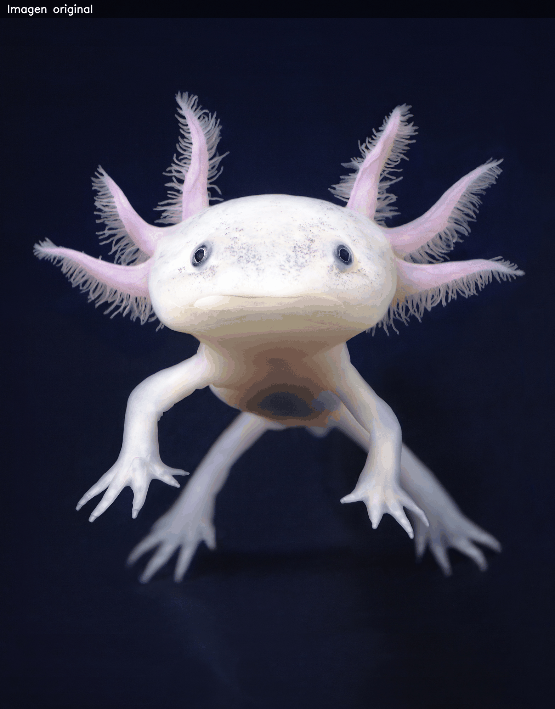
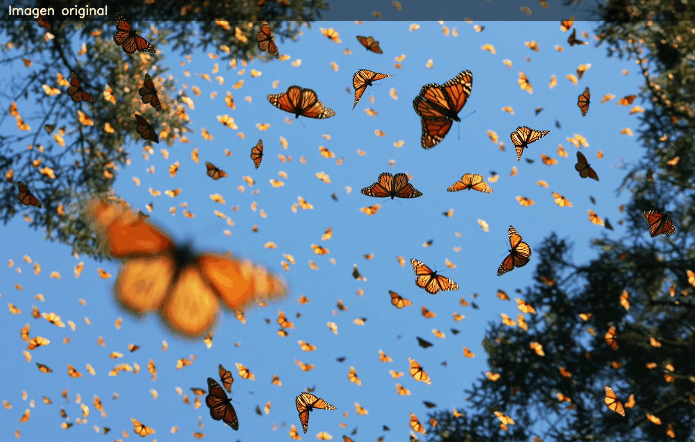

# Examen Final – Computación Visual

## Punto 1 – Python

Breve descripción del enfoque usado:

En el Punto 1 se implementó un pipeline de procesamiento de imágenes en Python utilizando OpenCV, NumPy y Matplotlib. A partir de una imagen RGB de un animal en vía de extinción, se aplicaron filtros de suavizado y realce de bordes, se trabajó con convoluciones mediante kernels personalizados y se realizaron operaciones morfológicas (apertura y cierre) sobre una versión binarizada de la imagen. Finalmente, se generaron GIFs que resumen visualmente los resultados de los filtros y de la morfología.

GIFs de ejemplo:

En la carpeta gifs se dejan 11 ejemplos de lo trabajado en esta pipeline

## Punto 2 – Three.js

Se desarrolló una escena 3D interactiva que representa una escultura cinética compuesta por un cubo base, una esfera, toro (Dona) y un cono, todos organizados en una composición vertical. Se aplicaron texturas, dos fuentes de iluminación física y un sistema propio de controles de cámara que permite rotación y zoom. La animación combina rotaciones, traslaciones suaves y movimientos orbitales para generar coherencia estética.

El cambio de perspectiva se implementó definiendo dos posiciones predeterminadas de la cámara (frontal y cenital), activadas mediante las teclas 1 y 2, lo que permite alternar rápidamente entre vistas de la escultura. Las animaciones se desarrollaron dentro del ciclo animate() de Three.js utilizando transformaciones continuas: rotación de la Tierra, movimiento orbital del toro, rotación del cono y rotacion de la esfera, logrando una pieza cinética coherente. Las texturas se aplicaron mediante TextureLoader, incluyendo un mapa equirectangular para la Tierra y texturas adicionales para el cubo, el toro, el cono y el piso, asignadas a materiales físicos MeshStandardMaterial para mejorar la iluminación. Se implementó un sistema propio de controles de cámara, que permite rotar la escena arrastrando el mouse y hacer zoom con la rueda,  garantizando una navegación fluida alrededor de la escultura.

Interacción:
- Mouse arrastrar → rotar cámara  
- Rueda del mouse → zoom  
- Tecla **1** → vista frontal  
- Tecla **2** → vista cenital  

## Como correr el proyecto 

### Python
Al ser un notebook de jupyter puedes correr las secciones por separado, estas secciones ya tienen las importaciones necesarias para que el proyecto corra correctamente, en la primera seccion se te preguntara el numero de la imagen que quieres ver, estos van desde el 1 hasta el 11, por el contrario puedes correr todo el cuaderno jupyter y se generara el gif final con todas las tranformaciones en la carpeta gifs.
### three.js
Hay que instalar la extension live server para correr el index.html, en el explorador de archivos darle click derecho al archivo index.html y **Open with Live Server** esto genera la escena en el navegador predeterminado y se puede explorar la escena.
